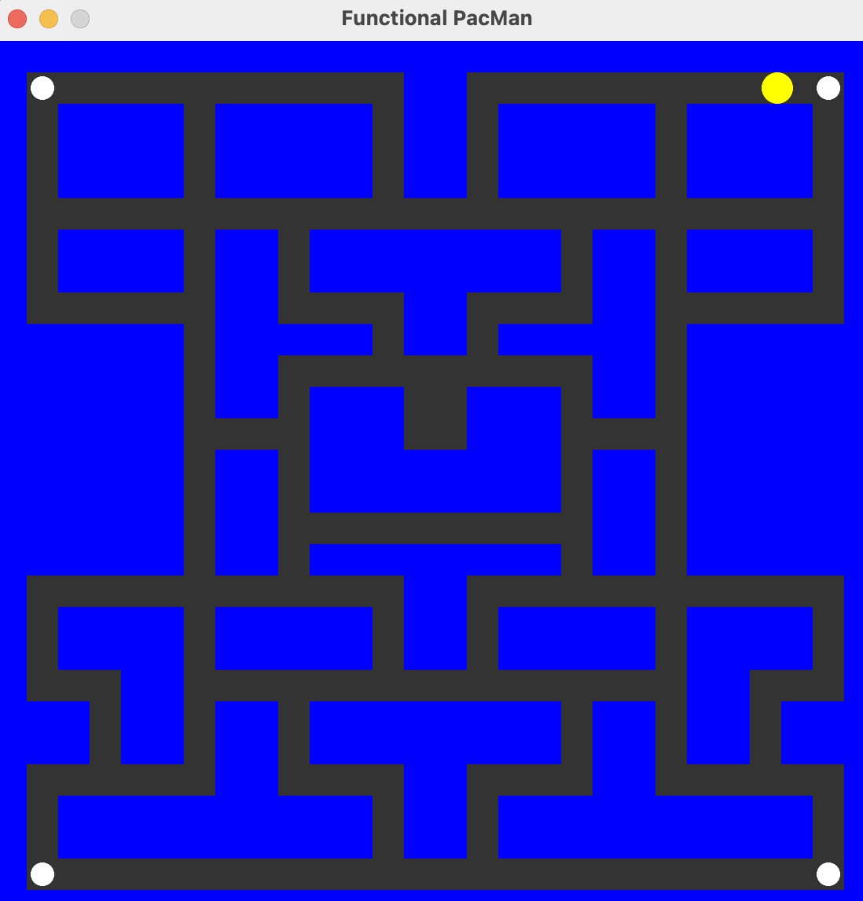

# Func Man

Functional pacman in Rust

## Motivation

This repo contains an implementation of the game PacMan, written in Rust, in a style that is attempting to be as 
functional as can be done pragmatically. It is trying to stay with the "8 bit" ethos of fixed clocks and pixels, while 
also attempting to marry that with a functional approach where the entire game is modelled as:

1. state
2. reducers (i.e. `fn tick(&prior_state, &input) -> new_state`)
3. renderers (i.e. `fn render(&state) -> image` )

It is strictly meant to be a fun learning opportunity (of both retro game engines & FP).

## Contributing

Contributions are welcome! Both as feedback on how it can be improved (issues), and pull requests!
